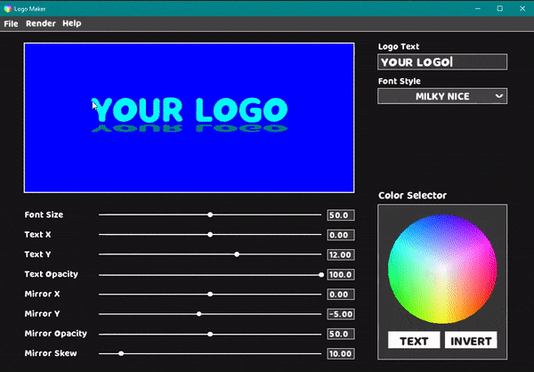

# Logo-Editor

Logo Editor is a C++ and SFML program allowing users to quickly make beautiful logos. 

## 3 Min Features and Demo Runthrough: 

https://youtu.be/nMJVPpL6l_Q

## Interface

## Sample Logos

|  |  |
|---|---|
|  |  |

## Tools Used
1. C++ (https://www.cplusplus.com/)
2. SFML (https://www.sfml-dev.org/)
